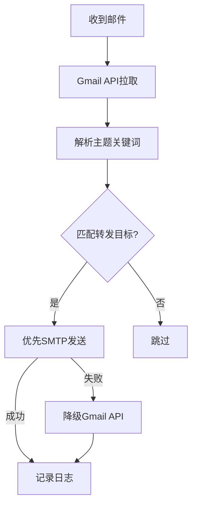

# 🚀 Gmail转发系统 - 快速开始

## 🎯 最简配置（推荐）

**您说得对！默认情况下，您只需要配置SMTP服务器即可，Gmail API作为备选！**

### ✅ 核心配置（仅需4项）

```bash
# 创建 .env 文件，只需要这4个配置：
SMTP_HOST=smtp.gmail.com
SMTP_PORT=587
SMTP_USER=your_email@gmail.com
SMTP_PASSWORD=your_app_password
```

### 🔧 系统默认行为

```bash
# 以下配置有智能默认值，无需手动设置：
✅ PREFER_SMTP=true        # 默认优先SMTP发送
✅ ENABLE_HYBRID=true      # 默认启用混合模式（API作备选）
✅ 自动检测账户类型        # 免费/Workspace/Business
✅ 自动适配发送限制        # 500/2000/3000封/天
```

## 📧 工作流程



## 🔑 获取Gmail应用密码（2024新政策）

⚠️ **重要**：Google已停止支持传统密码，必须使用应用密码！

### 快速获取步骤：

1. **启用两步验证**（必需前提）：
   - Google账户 → 安全性 → 两步验证 → 开始使用
   - 验证手机号码并启用

2. **生成应用密码**：
   - 直接访问：https://myaccount.google.com/apppasswords
   - 或：安全性 → 应用专用密码
   - 选择"其他" → 输入"Gmail转发系统"
   - 生成16位密码（删除空格后使用）

3. **⚠️ 安全提醒**：
   - 应用密码≠Gmail登录密码
   - 16位密码只显示一次，立即保存
   - 删除密码中的所有空格

## 🚀 启动系统

```bash
# 1. 克隆项目
git clone your-repo
cd gmail-forwarding-system

# 2. 配置环境（仅需4项）
cp .env.example .env
# 编辑 .env 文件，填入SMTP配置

# 3. 安装依赖
go mod tidy

# 4. 启动服务
go run main.go
```

## 📊 验证状态

```bash
# 检查服务状态
curl http://localhost:8080/api/status

# 响应示例：
{
  "gmail_api_available": false,    // 邮件拉取需要时再配置
  "smtp_available": true,          // ✅ SMTP已就绪
  "prefer_smtp": true,             // ✅ 优先SMTP发送
  "current_strategy": "SMTP优先，Gmail API备选"
}
```

## 💡 关键优势

| 配置复杂度 | 免费账户 | Workspace | Business |
|-----------|----------|-----------|----------|
| **仅SMTP配置** | 500封/天 | 2,000封/天 | 3,000封/天 |
| **无秒级限制** | ✅ | ✅ | ✅ |
| **部署时间** | < 5分钟 | < 5分钟 | < 5分钟 |

## 🔄 高级配置（可选）

如果需要邮件拉取功能，再添加Gmail API配置：

```bash
# Gmail API配置（仅拉取邮件需要）
GMAIL_CREDENTIALS_PATH=credentials.json
GMAIL_TOKEN_PATH=token.json
```

## ❓ 常见问题

**Q: 只配置SMTP能完整工作吗？**
A: 可以发送，但需要Gmail API来拉取邮件。推荐先配置SMTP测试发送功能。

**Q: 为什么推荐SMTP优先？**
A: SMTP无秒级限制，突破Gmail API的250配额/秒限制，特别适合高频转发。

**Q: 付费账户有什么优势？**
A: Workspace(2000封/天)、Business(3000封/天)，相比免费账户(500封/天)有巨大提升。

**Q: 如何切换发送方式？**
A: 设置`PREFER_SMTP=false`即可切换到Gmail API优先模式。

---

🎉 **恭喜！您现在只需4个配置就能启动Gmail转发系统！** 