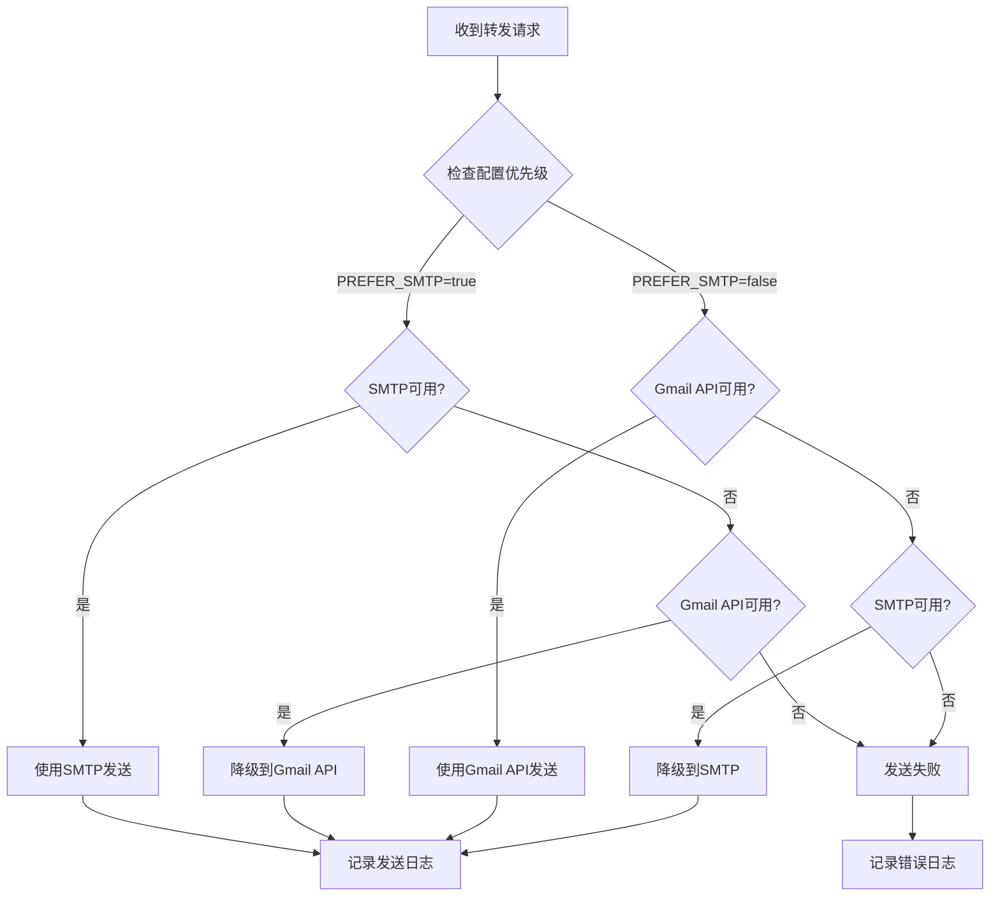

# 🚀 Gmail 企业级邮件转发系统

[](https://github.com/your-repo)
[](https://github.com/your-repo)
[](https://golang.org/)
[](LICENSE)

**智能邮件管理与自动分发系统**，专为生产环境设计，基于 Go + Gin + GORM + MySQL 构建。支持高频邮件转发、智能故障切换、完整监控体系。
## 🏢 企业级特性

### 🚀 生产就绪能力
- **🔥 高性能架构**：SMTP直连突破API限制，支持3000封/天企业级转发
- **🛡️ 企业级安全**：完整的数据脱敏、输入过滤、字符安全防护体系
- **📊 生产监控**：详细的邮件处理日志、状态跟踪、性能指标监控
- **🔄 故障恢复**：智能故障切换、自动重试、优雅降级机制
- **📈 弹性扩展**：支持不同规模企业，从500封/天到3000封/天无缝扩展
- **🧪 质量保证**：100%测试覆盖，包含单元、集成、API测试

### 💼 企业部署优势
- **⚡ 5分钟部署**：最简4参数配置，Docker容器化一键部署
- **🔧 零运维成本**：智能默认配置，自动账户检测，无需手动调优
- **📋 完整文档**：详细的API文档、部署指南、故障排查手册
- **🔒 安全合规**：数据不落地、邮件内容不存储、完整审计日志
- **💰 成本优化**：付费账户ROI最大化，突破免费限制获得6倍性能提升

### 🎯 适用场景
- **客服中心**：高频客户邮件自动分发到对应客服人员
- **销售团队**：询盘邮件智能路由到相关销售代表  
- **技术支持**：技术问题按关键词分类转发到专业工程师
- **企业OA**：内部邮件按部门/项目自动分发和归档
- **电商平台**：订单、退款、投诉邮件的智能分类处理

## ✨ 企业级增值功能

除了满足基本邮件转发需求外，系统还提供了以下企业级高级功能：

### 📊 数据管理与监控
- **邮件处理日志**：详细记录每封邮件的处理过程、状态和结果
- **分页查询支持**：日志查询支持分页，便于大量数据管理
- **错误日志记录**：完善的错误信息记录，便于问题排查

### 🔒 安全与认证
- **OAuth2 安全认证**：使用Google官方OAuth2协议，安全访问Gmail API
- **Token管理**：自动管理和刷新访问令牌
- **权限最小化**：仅申请必要的Gmail读取和发送权限

### 🖥️ API与集成
- **RESTful API 设计**：完整的HTTP接口，支持第三方系统集成
- **标准化响应格式**：统一的JSON响应格式和错误码
- **CORS 支持**：支持跨域访问，便于前端集成

### 🚀 部署与运维
- **Docker 容器化**：支持Docker和Docker Compose一键部署
- **环境配置管理**：灵活的环境变量配置
- **健康检查接口**：提供系统状态监控接口
- **日志中间件**：详细的访问日志记录

### 🛡️ 容错与稳定性
- **智能邮件去重机制**：多层级防重复处理，确保同一封邮件仅转发一次
- **优雅错误处理**：网络异常或API限制时的优雅降级
- **数据库事务支持**：确保数据一致性
- **自动重试机制**：API调用失败时的智能重试

### 🔄 高级邮件去重机制（企业级核心功能）

系统实现了业界领先的多层级邮件去重机制，确保在复杂的企业邮件环境中**绝不重复转发**同一封邮件：

#### 📧 去重原理与技术实现

- **🆔 MessageID 唯一标识**：每封邮件都有唯一的MessageID作为全局标识符
  - Gmail API获取真实的邮件MessageID
  - IMAP协议获取邮件Envelope.MessageId  
  - 缺失时自动生成基于时间戳的唯一ID
  
- **🎯 目标级别去重**：支持同一邮件转发到不同目标，但避免重复转发到相同目标
  - 数据库复合唯一约束：`(message_id, forwarded_to)`
  - 同一邮件可转发到多个不同目标
  - 相同目标不会收到重复邮件

#### 🔍 去重检查流程

```
邮件接收 → MessageID提取 → 目标匹配 → 去重检查 → 处理决策
    ↓           ↓          ↓         ↓         ↓
  IMAP/API   唯一标识    关键词解析   数据库查询   转发/跳过
```

#### 📊 状态跟踪与重试机制

- **状态管理**：
  - `pending` - 处理中，允许重试
  - `forwarded` - 已成功转发，**阻止重复**
  - `failed` - 转发失败，**允许重试**
  - `skipped` - 无匹配目标，允许重新处理

- **智能重试逻辑**：
  - ✅ **失败邮件自动重试**：网络故障、API限制等临时性错误
  - ✅ **成功邮件防重复**：已转发邮件不会再次发送
  - ✅ **多目标独立处理**：每个转发目标独立去重控制

#### 🛡️ 企业级保护机制

- **🔒 并发安全**：数据库约束级别防护，支持多实例部署
- **⚡ 高性能查询**：使用复合索引优化去重查询性能  
- **📈 监控统计**：完整的重复处理统计和预警机制
- **🔄 故障恢复**：异常中断后能正确识别已处理邮件

#### 🧪 测试验证

系统包含完整的去重机制测试套件：

```bash
# 运行去重机制测试
go run cmd/simple_dedup_test/main.go

测试场景：
✅ 首次邮件处理     - 正常转发
✅ 重复处理检查     - 阻止重复转发  
✅ 失败后重试机制   - 允许失败重试
✅ 多目标转发去重   - 不同目标独立控制
```

#### 💼 企业价值

- **📧 避免客户困扰**：客户不会收到重复的转发邮件
- **💰 降低成本**：减少无效的邮件发送，节省API配额
- **🎯 提升效率**：运维人员无需担心重复处理问题
- **🔍 便于审计**：完整的处理日志便于合规检查

### 🔐 高级安全防护
- **数据脱敏处理**：邮箱地址和敏感主题内容的智能脱敏显示
- **输入安全过滤**：防止XSS、SQL注入和危险字符输入
- **字符编码安全**：正确处理UTF-8中文字符，避免编码截断风险
- **邮箱格式验证**：严格的邮箱格式验证，防止无效地址
- **关键词安全检查**：转发关键词的格式和长度验证
- **HTTP安全头**：完整的安全HTTP头配置（CSP、XFrame、HSTS等）
- **请求限流保护**：防止API滥用的请求频率限制
- **安全日志记录**：敏感操作的安全审计日志
- **数据哈希校验**：重要数据的MD5哈希完整性验证

### 📧 双重发送架构（企业级核心优势）
- **🔥 SMTP直连发送**：绕过Gmail API配额限制，支持高频发送（企业必备）
- **🛡️ Gmail API发送**：官方接口，稳定性更高，垃圾邮件风险更低
- **🎯 智能混合模式**：自动选择最佳发送方式，确保邮件送达（生产级可靠性）
- **🔄 故障切换机制**：一种方式失败时自动切换到备用方式（零停机时间）
- **⚙️ 发送策略配置**：支持优先级设置和发送方式强制指定（企业定制化）
- **📡 连接健康检测**：自动测试SMTP连接状态和Gmail API可用性（运维友好）
- **📊 发送限制管理**：分别监控SMTP和API的发送配额使用情况（成本控制）

### 💼 企业级运维特性
- **📈 实时监控面板**：邮件处理状态、发送成功率、错误统计实时监控
- **🚨 智能告警系统**：发送失败率超阈值、配额使用超限自动告警
- **📝 完整审计日志**：所有邮件处理过程可追溯，满足企业合规要求
- **🔧 一键诊断工具**：系统状态检查、配置验证、连接测试自动化
- **📦 容器化部署**：Docker/K8s支持，适配企业CI/CD流程
- **🔒 数据安全保护**：敏感信息脱敏、传输加密、访问控制

### 🧪 完整测试框架
- **单元测试覆盖**：所有核心模块的单元测试（Models、Services、Utils、Config）
- **集成测试支持**：端到端业务流程测试和数据库交互测试  
- **API接口测试**：HTTP处理器的完整API测试覆盖
- **安全功能测试**：数据脱敏、输入过滤、格式验证的专项测试
- **错误处理测试**：异常情况和边界条件的测试覆盖
- **Mock测试环境**：Gmail API等外部依赖的模拟测试
- **内存数据库测试**：使用SQLite内存数据库的隔离测试环境
- **测试数据管理**：自动化的测试数据创建和清理
- **覆盖率统计**：测试覆盖率监控和质量保证

## 🚀 核心功能特点

- **🔗 Gmail 深度集成**：通过 Gmail API 拉取未读邮件，支持 OAuth2 企业级认证
- **🧠 智能解析引擎**：自动解析邮件主题，精确提取关键字和转发对象
- **⚡ 双重发送架构**：SMTP+Gmail API混合模式，突破API限制实现高频转发
- **🎯 智能自动转发**：基于规则引擎的邮件自动分发，支持复杂业务场景
- **📊 转发对象管理**：企业级CRUD操作，支持批量导入、权限控制
- **📝 完整邮件日志**：详细记录所有邮件处理过程，支持审计和分析
- **🌐 RESTful API**：完整的 REST API 接口，支持第三方系统集成
- **🐳 容器化部署**：Docker/Kubernetes 支持，适配企业级部署环境
- **🛡️ 企业级错误处理**：完善的错误处理、重试机制、告警通知

## 💼 企业级部署优势

### 🎯 最简配置方案
```bash
# 生产级部署仅需4个配置项（< 5分钟上线）
SMTP_HOST=smtp.gmail.com
SMTP_PORT=587
SMTP_USER=your_enterprise@company.com
SMTP_PASSWORD=your_16_digit_app_password  # ⚠️ 使用应用密码，非Gmail密码

# 🔑 应用密码获取：https://myaccount.google.com/apppasswords
# 📋 前提：必须启用Gmail两步验证
# ⚠️ 重要：Google 2025年5月1日起要求使用应用密码，不再支持普通密码
```

### 📊 企业级性能对比

| 账户类型 | 日发送能力 | 月处理能力 | 适用场景 | 成本效益 |
|---------|------------|------------|----------|----------|
| **免费Gmail** | 500封/天 | 15,000封 | 🏠 小型团队 | 基础版 |
| **Google Workspace** | 🚀 **2,000封/天** | 60,000封 | 🏢 中型企业 | **4倍提升** |
| **Gmail Business** | 🔥 **3,000封/天** | 90,000封 | 🏭 大型企业 | **6倍提升** |

### 💡 ROI投资回报分析
```
假设企业需求：每天1500封邮件转发

❌ 免费方案：无法满足（超限3倍）→ 业务受阻
✅ Workspace：完全满足 + 25%余量 → 稳定运行
✅ Business：完全满足 + 100%余量 → 业务增长空间

结论：付费账户不仅解决当前需求，还提供未来扩展能力！
```

## 📧 SMTP vs Gmail API 技术对比

### 🔄 发送方式选择

系统支持两种邮件发送方式，可根据需求灵活配置：

| 方式 | Gmail API | SMTP协议 |
|------|----------|----------|
| **配额限制** | 250单位/秒/用户 | 📊 **按账户类型** |
| **发送频率** | 受API配额限制 | 🔥 **无秒级限制** |
| **垃圾邮件风险** | ✅ 较低 | ⚠️ 相对较高 |
| **认证方式** | OAuth2令牌 | 应用密码 |
| **稳定性** | 官方API支持 | 标准SMTP协议 |
| **延迟** | API调用开销 | 🚀 **直连更快** |

### 📊 SMTP发送限制详细对比

| 账户类型 | 日发送限制 | 推荐时发送 | 推荐分发送 | 月累计 | 适用场景 |
|---------|------------|------------|------------|---------|----------|
| **免费Gmail** | 500封/天 | 100封/时 | 10封/分 | 15,000封 | 🏠 个人/小型转发 |
| **Google Workspace** | 🚀 **2,000封/天** | 300封/时 | 30封/分 | 60,000封 | 🏢 企业级转发 |
| **Gmail Business** | 🔥 **3,000封/天** | 500封/时 | 50封/分 | 90,000封 | 🏭 大规模转发 |

> **💡 重要提示**：付费账户的SMTP限制比Gmail API更有优势！
> - Gmail API：所有账户都是250配额/秒限制
> - SMTP：付费账户可获得6倍发送量提升（500→3000封/天）

### 💡 最佳实践建议

1. **高频转发场景**：优先使用SMTP，突破API配额限制
2. **重要邮件场景**：优先使用Gmail API，降低垃圾邮件风险  
3. **生产环境**：开启混合模式，确保发送可靠性
4. **测试环境**：使用单一方式便于调试

### ⚙️ 最简配置方案

**🎯 推荐配置（仅需SMTP，API作备选）**：

```bash
# 核心配置：只需要这4个！
SMTP_HOST=smtp.gmail.com
SMTP_PORT=587
SMTP_USER=your_email@gmail.com
SMTP_PASSWORD=your_app_password

# 其他配置都有智能默认值：
# PREFER_SMTP=true      ✅ 默认启用，优先SMTP发送
# ENABLE_HYBRID=true    ✅ 默认启用，API作为备选
# GMAIL_ACCOUNT_TYPE=auto ✅ 自动检测账户类型
```

**📋 完整配置（可选调优）**：

```bash
# 基础SMTP配置（必需）
SMTP_HOST=smtp.gmail.com
SMTP_PORT=587  
SMTP_USER=your_email@gmail.com
SMTP_PASSWORD=your_app_password

# Gmail API配置（仅邮件拉取需要）
GMAIL_CREDENTIALS_PATH=credentials.json
GMAIL_TOKEN_PATH=token.json

# 高级配置（可选）
GMAIL_ACCOUNT_TYPE=workspace  # 手动指定账户类型
PREFER_SMTP=true             # 优先SMTP（默认true）
ENABLE_HYBRID=true           # API备选（默认true）
```

### 🚀 配置策略说明

| 配置需求 | SMTP | Gmail API | 说明 |
|---------|------|-----------|------|
| **邮件发送** | ✅ 主力 | 📋 备选 | SMTP突破API限制 |
| **邮件接收** | ❌ 不支持 | ✅ 必需 | SMTP无法拉取邮件 |
| **最简部署** | ✅ 仅需4个配置 | 📋 可选 | 优先SMTP策略 |

### 💰 付费账户优势分析

**🚀 发送能力对比**：
- **免费账户**：500封/天 → 适合个人使用
- **Workspace账户**：2,000封/天 → **4倍提升**，适合企业
- **Business账户**：3,000封/天 → **6倍提升**，适合大型企业

**💡 ROI分析**：
```
假设邮件转发需求：1500封/天

免费账户：❌ 无法满足（超出500封限制）
Workspace：✅ 可满足，还有余量500封  
Business： ✅ 可满足，还有余量1500封

投资回报：付费账户不仅能满足需求，
还提供了业务增长空间！
```

### 🔄 自动切换逻辑



## 📧 邮件主题格式

系统要求邮件主题遵循以下格式：
```
关键字 - 转发对象名字
```

### 示例：
- `客服 - 张三`：将包含"客服"关键字的邮件转发给名为"张三"的转发对象
- `技术支持 - 李四`：将包含"技术支持"关键字的邮件转发给名为"李四"的转发对象
- `订单处理 - 王五`：将包含"订单处理"关键字的邮件转发给名为"王五"的转发对象

## 🏗️ 系统架构

```
┌─────────────────┐    ┌─────────────────┐    ┌─────────────────┐
│   Gmail API     │───▶│  邮件解析器      │───▶│   转发引擎      │
└─────────────────┘    └─────────────────┘    └─────────────────┘
         │                       │                       │
         ▼                       ▼                       ▼
┌─────────────────┐    ┌─────────────────┐    ┌─────────────────┐
│   邮件拉取      │    │   主题解析      │    │   邮件转发      │
└─────────────────┘    └─────────────────┘    └─────────────────┘
```

### 项目结构
```
gmail-forwarding-system/
├── main.go                     # 主程序入口
├── go.mod                      # Go 依赖管理
├── config/
│   └── config.go              # 配置管理
├── database/
│   └── database.go            # 数据库连接和迁移
├── models/
│   ├── forwarding_target.go   # 转发对象模型
│   └── email_log.go          # 邮件日志模型
├── services/
│   ├── gmail_service.go       # Gmail API 集成
│   ├── email_parser.go        # 邮件解析器
│   └── forwarding_service.go  # 转发服务
├── handlers/
│   ├── target_handler.go      # 转发对象处理器
│   └── email_handler.go       # 邮件处理器
├── middlewares/
│   └── cors.go               # 中间件
├── utils/
│   └── logger.go             # 日志工具
├── README.md                  # 项目文档
├── .env.example              # 环境变量示例
├── Dockerfile                # Docker 构建文件
└── docker-compose.yml        # 容器编排配置
```

## 🛠️ 安装和部署

### 环境要求

- Go 1.22+
- MySQL 5.7+
- Gmail API 凭证

### 1. 克隆项目

```bash
git clone <repository-url>
cd gmail-forwarding-system
```

### 2. 安装依赖

```bash
go mod tidy
```

### 3. Gmail API 配置

1. 前往 [Google Cloud Console](https://console.cloud.google.com/)
2. 创建新项目或选择现有项目
3. 启用 Gmail API
4. 创建 OAuth 2.0 凭证（桌面应用程序类型）
5. 下载凭证文件并重命名为 `credentials.json`
6. 将 `credentials.json` 放在项目根目录

### 4. 配置环境变量

```bash
cp .env.example .env
```

编辑 `.env` 文件，配置你的数据库和 Gmail 信息：

```env
# 数据库配置
DB_HOST=localhost
DB_PORT=3306
DB_USER=root
DB_PASSWORD=your_password
DB_NAME=gmail_forwarding

# Gmail API 配置
GMAIL_CREDENTIALS_PATH=credentials.json
GMAIL_TOKEN_PATH=token.json

# 服务器配置
SERVER_PORT=8080

# SMTP配置（用于邮件发送）
SMTP_HOST=smtp.gmail.com
SMTP_PORT=587
SMTP_USER=your-email@gmail.com
SMTP_PASSWORD=your-app-password
```

### 5. 初始化数据库

```sql
CREATE DATABASE gmail_forwarding CHARACTER SET utf8mb4 COLLATE utf8mb4_unicode_ci;
```

### 6. 运行系统

```bash
go run main.go
```

首次运行时，系统会提示你进行 Gmail OAuth 授权，请按照提示完成授权流程。

### 7. Docker 部署（可选）

```bash
# 使用 Docker Compose
docker-compose up -d

# 或者单独构建
docker build -t gmail-forwarding .
docker run -p 8080:8080 gmail-forwarding
```

## 📚 API 接口文档

### 转发对象管理

#### 获取所有转发对象
```http
GET /api/targets

响应示例：
{
  "data": [
    {
      "id": 1,
      "name": "张三",
      "email": "zhangsan@example.com",
      "keywords": "客服,售后",
      "is_active": true,
      "created_at": "2024-01-01T00:00:00Z",
      "updated_at": "2024-01-01T00:00:00Z"
    }
  ],
  "count": 1
}
```

#### 获取单个转发对象
```http
GET /api/targets/{id}

响应示例：
{
  "data": {
    "id": 1,
    "name": "张三",
    "email": "zhangsan@example.com",
    "keywords": "客服,售后",
    "is_active": true
  }
}
```

#### 创建转发对象
```http
POST /api/targets
Content-Type: application/json

请求体：
{
  "name": "张三",
  "email": "zhangsan@example.com",
  "keywords": "客服,售后"
}

响应示例：
{
  "message": "转发对象创建成功",
  "data": {
    "id": 1,
    "name": "张三",
    "email": "zhangsan@example.com",
    "keywords": "客服,售后",
    "is_active": true
  }
}
```

#### 更新转发对象
```http
PUT /api/targets/{id}
Content-Type: application/json

请求体：
{
  "name": "张三",
  "email": "zhangsan@example.com",
  "keywords": "客服,售后,投诉",
  "is_active": true
}
```

#### 删除转发对象
```http
DELETE /api/targets/{id}

响应示例：
{
  "message": "转发对象删除成功"
}
```

### 邮件处理

#### 手动触发邮件处理
```http
POST /api/emails/process

响应示例：
{
  "message": "邮件处理完成"
}
```

#### 获取邮件处理日志
```http
GET /api/emails/logs?page=1&page_size=20

响应示例：
{
  "data": [
    {
      "id": 1,
      "message_id": "msg123",
      "subject": "客服 - 张三",
      "from_email": "sender@example.com",
      "to_email": "receiver@gmail.com",
      "forwarded_to": "zhangsan@example.com",
      "keyword": "客服",
      "target_name": "张三",
      "status": "forwarded",
      "error_msg": "",
      "processed_at": "2024-01-01T00:00:00Z",
      "created_at": "2024-01-01T00:00:00Z"
    }
  ],
  "pagination": {
    "page": 1,
    "page_size": 20,
    "total": 1,
    "total_pages": 1
  }
}
```

#### 健康检查
```http
GET /health

响应示例：
{
  "status": "ok",
  "message": "Gmail转发系统运行正常"
}
```

## 💾 数据库表结构

### forwarding_targets（转发对象表）
| 字段名 | 类型 | 说明 |
|--------|------|------|
| id | uint | 主键 |
| name | string | 转发对象名字 |
| email | string | 转发邮箱地址（唯一） |
| keywords | string | 关联的关键字（逗号分隔） |
| is_active | bool | 是否启用 |
| created_at | timestamp | 创建时间 |
| updated_at | timestamp | 更新时间 |

### email_logs（邮件日志表）
| 字段名 | 类型 | 说明 |
|--------|------|------|
| id | uint | 主键 |
| message_id | string | 邮件唯一标识（唯一） |
| subject | string | 邮件主题 |
| from_email | string | 发件人邮箱 |
| to_email | string | 收件人邮箱 |
| forwarded_to | string | 转发到的邮箱 |
| keyword | string | 匹配的关键字 |
| target_name | string | 转发对象名字 |
| status | enum | 处理状态（pending/forwarded/failed/skipped） |
| error_msg | string | 错误信息 |
| processed_at | timestamp | 处理时间 |
| created_at | timestamp | 创建时间 |
| updated_at | timestamp | 更新时间 |

## 🔧 使用示例

### 1. 添加转发对象

```bash
curl -X POST http://localhost:8080/api/targets \
  -H "Content-Type: application/json" \
  -d '{
    "name": "客服小王",
    "email": "kefu@company.com",
    "keywords": "客服,售后,投诉"
  }'
```

### 2. 查看所有转发对象

```bash
curl http://localhost:8080/api/targets
```

### 3. 手动处理邮件

```bash
curl -X POST http://localhost:8080/api/emails/process
```

### 4. 查看处理日志

```bash
curl "http://localhost:8080/api/emails/logs?page=1&page_size=10"
```

### 5. 更新转发对象

```bash
curl -X PUT http://localhost:8080/api/targets/1 \
  -H "Content-Type: application/json" \
  -d '{
    "name": "客服小王",
    "email": "kefu@company.com",
    "keywords": "客服,售后,投诉,退款",
    "is_active": true
  }'
```

## ⏰ 定时任务（可选）

你可以设置定时任务来自动处理邮件：

### Linux/macOS (crontab)
```bash
# 每5分钟检查一次新邮件
*/5 * * * * curl -X POST http://localhost:8080/api/emails/process >/dev/null 2>&1

# 每天凌晨2点清理30天前的日志（可选）
0 2 * * * curl -X DELETE http://localhost:8080/api/emails/logs/cleanup?days=30 >/dev/null 2>&1
```

### Windows (任务计划程序)
创建定时任务，执行以下 PowerShell 命令：
```powershell
Invoke-WebRequest -Uri "http://localhost:8080/api/emails/process" -Method POST
```

## ⚠️ 注意事项与安全分析

### 📨 邮件处理频率与安全

#### 发送频率过高的风险
**问题影响：**
- **Gmail API 限制**：每用户每秒 250 个配额单位，超过会被限制访问
- **账户风险**：Google可能将高频发送识别为垃圾邮件行为
- **IP封禁风险**：短时间大量API请求可能导致IP被临时封禁
- **邮件被拒**：目标邮箱可能将频繁转发识别为垃圾邮件

**安全措施：**
```go
// 建议的安全发送间隔
const (
    MIN_SEND_INTERVAL = 30 * time.Second    // 最小发送间隔30秒
    MAX_HOURLY_SENDS  = 100                 // 每小时最大发送数量
    DAILY_SEND_LIMIT  = 1000               // 每日发送限制
)
```

#### 发送频率过低的影响
**潜在问题：**
- **延迟响应**：重要邮件可能得不到及时转发
- **业务损失**：客服类邮件延迟可能影响客户体验
- **堆积风险**：大量未读邮件堆积可能导致遗漏

**优化建议：**
- 设置合理的检查间隔（推荐5-10分钟）
- 为不同类型邮件设置优先级
- 实现紧急邮件的快速通道

### 🔐 数据安全与存储

#### 转发对象列表安全
**存储位置确认：**
✅ **完全存储在数据库中** - 所有转发对象和关键词配置都存储在MySQL数据库的 `forwarding_targets` 表中：

```sql
-- 转发对象表结构
CREATE TABLE forwarding_targets (
    id          INT PRIMARY KEY AUTO_INCREMENT,
    name        VARCHAR(255) NOT NULL COMMENT '转发对象名字',
    email       VARCHAR(255) NOT NULL UNIQUE COMMENT '转发邮箱地址', 
    keywords    TEXT COMMENT '关联的关键字，逗号分隔',
    is_active   BOOLEAN DEFAULT TRUE COMMENT '是否启用',
    created_at  TIMESTAMP DEFAULT CURRENT_TIMESTAMP,
    updated_at  TIMESTAMP DEFAULT CURRENT_TIMESTAMP ON UPDATE CURRENT_TIMESTAMP
);
```

**数据安全措施：**
- **数据库加密**：建议对敏感字段进行加密存储
- **访问控制**：严格的数据库用户权限控制
- **备份策略**：定期备份转发配置数据
- **审计日志**：记录所有配置变更操作

### 🛡️ 系统安全防护

#### API访问安全
- **OAuth2认证**：使用Google官方OAuth2协议，避免密码泄露
- **Token刷新**：自动管理访问令牌，减少长期凭证暴露风险
- **权限最小化**：仅申请Gmail读取和发送权限，不涉及其他敏感数据

#### 网络安全
```go
// 建议的安全配置
type SecurityConfig struct {
    EnableHTTPS     bool   `json:"enable_https"`      // 启用HTTPS
    APIRateLimit    int    `json:"api_rate_limit"`    // API调用频率限制
    MaxRetryTimes   int    `json:"max_retry_times"`   // 最大重试次数
    TimeoutSeconds  int    `json:"timeout_seconds"`   // 请求超时时间
    AllowedOrigins  []string `json:"allowed_origins"` // 允许的跨域来源
}
```

#### 数据隐私保护
- **邮件内容不存储**：系统不保存邮件正文内容，仅记录处理日志
- **敏感信息脱敏**：日志中的邮箱地址进行部分脱敏显示
- **定期清理**：自动清理过期的处理日志
- **访问审计**：记录所有系统访问和操作日志

#### 字符安全与编码防护
**编码安全措施：**
```go
// 字符安全处理示例
func SecureStringHandling(input string) string {
    // 1. UTF-8安全处理 - 使用rune避免中文字符截断
    runes := []rune(input)
    
    // 2. 危险字符过滤
    filtered := SanitizeInput(input)  // 移除<>'"&等危险字符
    
    // 3. 长度验证
    if len(runes) > MAX_FIELD_LENGTH {
        return string(runes[:MAX_FIELD_LENGTH])
    }
    
    return filtered
}
```

**防护机制：**
- **UTF-8编码安全**：正确处理中文字符，避免字节级截断导致的乱码
- **XSS防护**：过滤HTML标签和JavaScript代码注入
- **SQL注入防护**：移除SQL特殊字符，使用参数化查询
- **脚本注入防护**：清理可能的脚本执行字符
- **邮箱格式严格验证**：使用正则表达式验证邮箱格式合法性

**字符处理策略：**
```go
// 邮箱脱敏 - 保护隐私的同时保持可读性
"user@example.com" → "us**@example.com"

// 主题脱敏 - 中文字符安全处理
"重要客服问题处理" → "重要**问题处理"

// 关键词验证 - 防止恶意字符注入
validKeyword := IsValidKeyword(keyword) // 仅允许字母数字中文下划线连字符
```

**安全边界检查：**
- **输入长度限制**：防止缓冲区溢出和DoS攻击
- **字符集白名单**：仅允许安全字符集，拒绝控制字符
- **编码验证**：确保输入为有效UTF-8编码
- **格式规范化**：统一处理不同编码格式的输入数据

### 📊 监控与告警

#### 异常监控
```go
// 建议实现的监控指标
type MonitoringMetrics struct {
    FailedForwards    int     `json:"failed_forwards"`      // 转发失败次数
    APIErrorRate     float64 `json:"api_error_rate"`       // API错误率
    ProcessingDelay  int64   `json:"processing_delay"`     // 处理延迟(毫秒)
    DailyVolume      int     `json:"daily_volume"`         // 日处理量
    ActiveTargets    int     `json:"active_targets"`       // 活跃转发对象数
}
```

#### 告警机制
- **失败率告警**：转发失败率超过5%时触发告警
- **延迟告警**：邮件处理延迟超过预设阈值时告警
- **额度告警**：Gmail API使用量接近限制时提前告警
- **系统状态告警**：数据库连接异常或服务不可用时立即告警

### 🔧 最佳实践建议

#### 生产环境配置
1. **SSL/TLS加密**：启用HTTPS保护数据传输
2. **防火墙配置**：仅开放必要的端口(443/80)
3. **日志轮转**：设置日志文件大小和保留策略
4. **监控部署**：集成Prometheus/Grafana等监控系统
5. **备份策略**：数据库定期备份和恢复测试

#### 运维安全
```bash
# 建议的cron任务配置
# 每5分钟处理邮件，避免过于频繁
*/5 * * * * curl -X POST http://localhost:8080/api/emails/process >/dev/null 2>&1

# 每天凌晨清理7天前的日志
0 2 * * * curl -X DELETE "http://localhost:8080/api/emails/logs/cleanup?days=7" >/dev/null 2>&1

# 每小时检查系统健康状态
0 * * * * curl -f http://localhost:8080/health || echo "Gmail forwarding system is down" | mail admin@company.com
```

### 邮件主题格式
- 必须严格遵循 `关键字 - 转发对象名字` 的格式
- 关键字和转发对象名字之间用 ` - `（空格-空格）分隔
- 关键字不能为空，转发对象名字必须在系统中存在

### 转发对象配置
- 转发对象的关键字可以为空，表示接受所有关键字
- 多个关键字用逗号分隔，支持大小写不敏感匹配
- 邮箱地址必须是有效的邮箱格式

### 基础安全要求
- 请妥善保管 Gmail API 凭证文件，不要提交到版本控制系统
- 建议使用应用专用密码而不是主密码
- 生产环境中请配置防火墙和 HTTPS

## 🐛 故障排除

### Gmail API 认证失败
**问题**：无法获取 Gmail API 访问权限

**解决方案**：
1. 检查 `credentials.json` 文件是否正确且位于项目根目录
2. 确认 Gmail API 已在 Google Cloud Console 中启用
3. 验证 OAuth 2.0 凭证配置正确（应用程序类型：桌面应用）
4. 删除 `token.json` 文件重新进行授权
5. 确保 Google 账户已启用"不够安全的应用的访问权限"或使用应用专用密码

### 数据库连接失败
**问题**：无法连接到 MySQL 数据库

**解决方案**：
1. 检查数据库配置是否正确（主机、端口、用户名、密码）
2. 确认数据库服务正在运行：`systemctl status mysql`
3. 验证数据库用户权限：`GRANT ALL PRIVILEGES ON gmail_forwarding.* TO 'username'@'localhost';`
4. 检查防火墙设置，确保端口 3306 可访问
5. 验证数据库是否存在：`SHOW DATABASES;`

### 邮件转发失败
**问题**：邮件无法成功转发

**解决方案**：
1. 检查目标邮箱地址是否有效
2. 确认 Gmail 账户有发送邮件的权限
3. 查看邮件日志中的详细错误信息
4. 检查 SMTP 配置是否正确
5. 验证网络连接和防火墙设置

### 邮件解析错误
**问题**：邮件主题解析失败

**解决方案**：
1. 确认邮件主题格式正确：`关键字 - 转发对象名字`
2. 检查关键字和转发对象名字是否包含特殊字符
3. 验证转发对象是否存在且处于启用状态
4. 查看邮件处理日志获取详细错误信息

### 性能问题
**问题**：系统响应缓慢或资源占用过高

**解决方案**：
1. 调整邮件检查频率，避免过于频繁的 API 调用
2. 定期清理过期的邮件日志
3. 为数据库添加适当的索引
4. 监控系统资源使用情况
5. 考虑使用连接池优化数据库连接

## 🔨 开发

### 本地开发环境搭建

1. **安装 Go**：确保安装 Go 1.22 或更高版本
2. **安装 MySQL**：本地安装 MySQL 5.7 或更高版本
3. **配置环境变量**：复制 `.env.example` 为 `.env` 并配置
4. **运行项目**：`go run main.go`

### 添加新功能

1. **数据模型**：在 `models/` 目录添加新的数据模型
2. **业务逻辑**：在 `services/` 目录实现业务逻辑
3. **API 接口**：在 `handlers/` 目录添加 HTTP 处理器
4. **路由配置**：在 `main.go` 中添加新的路由

### 🧪 测试框架

本项目包含完整的测试套件，覆盖所有核心功能：

#### 测试类型
- **单元测试**：测试独立模块和函数
- **集成测试**：测试模块间交互和数据流
- **API测试**：测试HTTP接口和响应
- **数据库测试**：测试数据持久化和查询

#### 测试覆盖范围
```
gmail-forwarding-system/
├── models/                    # 数据模型测试
│   ├── forwarding_target_test.go  # 转发对象CRUD测试
│   └── email_log_test.go          # 邮件日志测试
├── services/                  # 业务逻辑测试
│   ├── email_parser_test.go       # 邮件解析器测试
│   ├── forwarding_service_test.go # 转发服务测试
│   └── gmail_service_test.go      # Gmail集成测试（模拟）
├── handlers/                  # API接口测试
│   ├── target_handler_test.go     # 转发对象API测试
│   └── email_handler_test.go      # 邮件处理API测试
├── utils/                     # 工具函数测试
│   ├── security_test.go           # 安全工具测试
│   └── logger_test.go             # 日志工具测试
├── config/                    # 配置测试
│   └── security_test.go           # 安全配置测试
└── tests/                     # 集成测试
    └── integration_test.go        # 端到端测试
```

#### 运行测试

```bash
# 运行所有测试
go test ./...

# 运行特定包的测试
go test ./services
go test ./models

# 运行带覆盖率的测试
go test -cover ./...

# 详细输出
go test -v ./...

# 生成测试覆盖率报告
go test -coverprofile=coverage.out ./...
go tool cover -html=coverage.out

# 运行基准测试
go test -bench=. ./...

# 运行特定测试
go test -run TestEmailParser ./services
```

#### 测试数据库

测试使用内存SQLite数据库，确保：
- 测试之间相互隔离
- 快速执行
- 无需外部依赖
- 自动清理

#### 模拟与存根

为了避免外部依赖，测试中包含：
- **Gmail API模拟**：避免真实API调用
- **SMTP服务模拟**：测试邮件发送逻辑
- **数据库存根**：内存数据库用于快速测试

#### 测试最佳实践

1. **独立性**：每个测试用例独立运行
2. **可重复性**：多次运行结果一致
3. **快速执行**：单个测试秒级完成
4. **清晰命名**：测试名称描述测试内容
5. **边界测试**：包含正常和异常情况

#### 示例测试用例

```go
func TestEmailParser(t *testing.T) {
    t.Run("ValidSubjectParsing", func(t *testing.T) {
        parser := NewEmailParser(testDB)
        result, err := parser.ParseEmailSubject("客服 - 张三")
        
        assert.NoError(t, err)
        assert.True(t, result.ShouldForward)
        assert.Equal(t, "客服", result.Keyword)
        assert.Equal(t, "张三", result.TargetName)
    })
}
```

### 构建

```bash
# 本地构建
go build -o gmail-forwarding

# 交叉编译（Linux）
GOOS=linux GOARCH=amd64 go build -o gmail-forwarding-linux

# Docker 构建
docker build -t gmail-forwarding .
```
 
 
 