# 📊 数据库ER关系图

```mermaid
erDiagram
    FORWARDING_TARGETS {
        uint id PK "主键ID"
        string name "转发对象名字"
        string email "转发邮箱地址"
        string keywords "关联关键字(逗号分隔)"
        bool is_active "是否启用"
        timestamp created_at "创建时间"
        timestamp updated_at "更新时间"
    }
    
    EMAIL_LOGS {
        uint id PK "主键ID"
        string message_id "邮件唯一标识"
        string subject "邮件主题"
        string from_email "发件人邮箱"
        string to_email "收件人邮箱"
        string forwarded_to "转发到的邮箱"
        string keyword "匹配的关键字"
        string target_name "转发对象名字"
        enum status "处理状态(pending/forwarded/failed/skipped)"
        string error_msg "错误信息"
        timestamp processed_at "处理时间"
        timestamp created_at "创建时间"
        timestamp updated_at "更新时间"
    }
    
    CONFIG {
        string server_port "服务器端口"
        string db_host "数据库主机"
        string db_port "数据库端口"
        string db_user "数据库用户"
        string db_password "数据库密码"
        string db_name "数据库名称"
        string gmail_credentials_path "Gmail凭证路径"
        string gmail_token_path "Gmail令牌路径"
        string imap_host "IMAP主机"
        int imap_port "IMAP端口"
        string imap_user "IMAP用户"
        string imap_password "IMAP密码"
        string smtp_host "SMTP主机"
        int smtp_port "SMTP端口"
        string smtp_user "SMTP用户"
        string smtp_password "SMTP密码"
        bool prefer_imap "优先使用IMAP"
        bool enable_hybrid "启用混合模式"
        bool prefer_smtp "优先使用SMTP"
        bool enable_smtp_hybrid "启用SMTP混合"
        int email_check_interval "邮件检查间隔(秒)"
        bool auto_monitor "自动监听"
    }
    
    EMAIL_DATA {
        string id "邮件ID"
        string message_id "邮件MessageID"
        string from "发件人"
        string subject "主题"
        string body "正文内容"
        timestamp received_time "接收时间"
    }
    
    PARSED_EMAIL_INFO {
        string keyword "匹配关键字"
        string target_name "目标名称"
        object target "ForwardingTarget对象"
        bool should_forward "是否转发"
        array matched_targets "匹配的多个目标"
    }

    FORWARDING_TARGETS ||--o{ EMAIL_LOGS : "一对多关系"
    EMAIL_LOGS }o--|| EMAIL_DATA : "记录邮件处理"
    EMAIL_DATA ||--|| PARSED_EMAIL_INFO : "解析邮件"
    PARSED_EMAIL_INFO }o--|| FORWARDING_TARGETS : "匹配目标"
```

## 说明
- **FORWARDING_TARGETS**: 转发目标配置表，存储邮件转发规则
- **EMAIL_LOGS**: 邮件处理日志表，记录每封邮件的处理结果
- **复合唯一约束**: `(message_id, forwarded_to)` 防止重复转发
- **一对多关系**: 一个转发目标可以处理多封邮件 