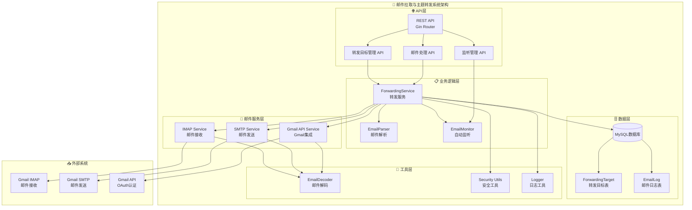

# 🏗️ 系统架构图

## 架构说明

### 🌐 API层
- **REST API**: 基于Gin框架的RESTful接口
- **转发目标管理**: CRUD操作转发规则
- **邮件处理**: 手动触发邮件处理
- **监听管理**: 启动/停止自动监听

### 📋 业务逻辑层  
- **ForwardingService**: 核心转发逻辑，包含去重机制
- **EmailParser**: 邮件主题解析和关键词匹配
- **EmailMonitor**: 自动监听新邮件

### 📨 邮件服务层
- **IMAP Service**: 连接Gmail IMAP接收邮件
- **SMTP Service**: 通过SMTP发送邮件
- **Gmail API Service**: 使用Gmail API收发邮件

### 🗄️ 数据层
- **MySQL**: 生产级数据库
- **ForwardingTarget**: 转发目标配置
- **EmailLog**: 邮件处理日志

### 🔧 工具层
- **EmailDecoder**: 处理中文编码和HTML清理
- **Security Utils**: 数据脱敏和安全功能
- **Logger**: 结构化日志 