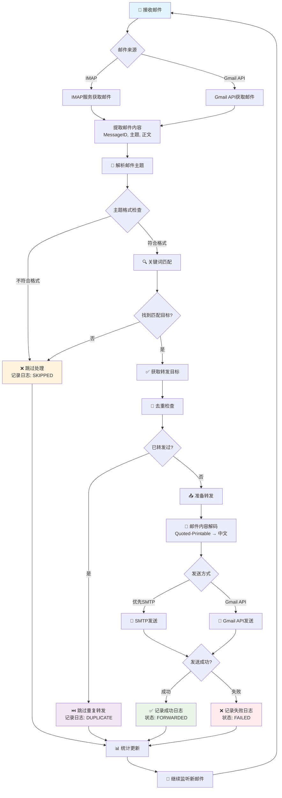

# 🔄 数据流程图

## 流程说明

### 📧 邮件接收阶段
1. **多源接收**: 支持IMAP和Gmail API两种方式
2. **内容提取**: 获取MessageID、主题、正文等关键信息
3. **格式验证**: 确保邮件主题符合 `内容 - 转发对象名字` 格式

### 🔍 智能匹配阶段  
1. **关键词解析**: 从主题中提取关键词和目标名称
2. **模糊匹配**: 支持关键词的模糊匹配
3. **目标查找**: 在数据库中查找匹配的转发目标

### 🔄 企业级去重阶段
1. **MessageID检查**: 基于邮件唯一标识符
2. **目标级去重**: 同一邮件可转发给多个目标，但不重复转发给同一目标
3. **状态记录**: 完整追踪处理状态

### 📤 智能转发阶段
1. **内容解码**: 处理中文Quoted-Printable编码
2. **多渠道发送**: SMTP优先，Gmail API备选
3. **格式标准化**: 使用标准转发格式

### 📊 监控统计阶段
1. **状态更新**: 实时更新处理状态
2. **错误处理**: 记录详细错误信息
3. **持续监听**: 自动循环处理新邮件 